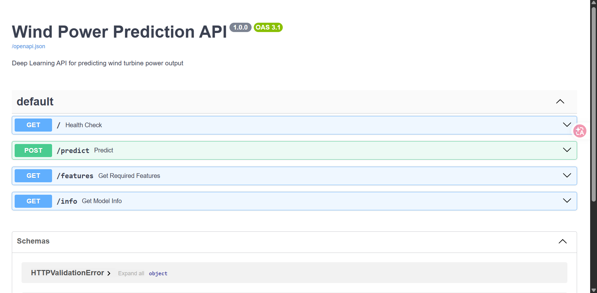
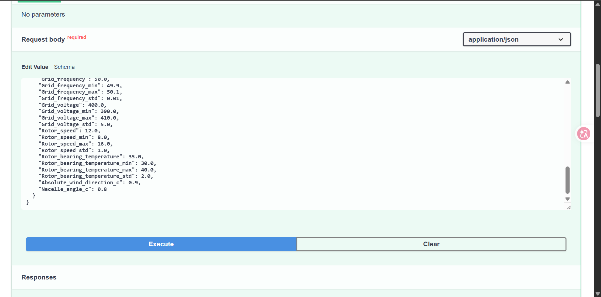
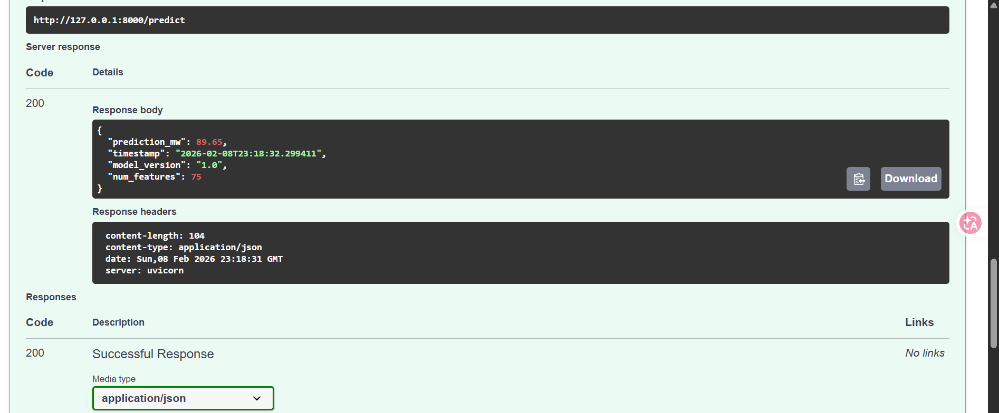

# 🌬️ Wind Power Prediction API

[](https://www.python.org/)
[](https://fastapi.tiangolo.com/)
[](https://hub.docker.com/r/falleiz/wind-power-api)
[](https://pytorch.org/)

> **Deep Learning API for predicting wind turbine power output using sensor data.**

---

## 📋 Table des matières

1. [Contexte du projet](#-contexte-du-projet)
2. [Architecture du projet](#-architecture-du-projet)
3. [Installation](#-installation)
4. [Entraînement du modèle](#-entraînement-du-modèle)
5. [Utilisation de l'API](#-utilisation-de-lapi)
6. [Docker](#-docker)
7. [Exemple de prédiction](#-exemple-de-prédiction)
8. [Auteurs](#-auteurs)

---

## 🎯 Contexte du projet

Les éoliennes produisent de l'électricité en fonction de nombreux facteurs : vitesse du vent, température, angle des pales, etc. **Prédire la puissance produite** permet aux opérateurs de mieux gérer le réseau électrique et d'optimiser la production.

### Objectif

Développer une **API de prédiction** capable d'estimer la puissance électrique (MW) d'une éolienne à partir des données de ses capteurs en temps réel.

### Données

- **Source** : Dataset Engie (données réelles d'éoliennes)
- **Téléchargement** : [Kaggle - Energy Consumption](https://www.kaggle.com/datasets/rosteim/energy-consumption)
- **Features** : 75 variables (températures, vitesses, angles, etc.)
- **Target** : Puissance produite en MW

### Pipeline

```
Données brutes → Preprocessing → Entraînement DNN → API FastAPI → Docker
```

| Étape | Description |
|-------|-------------|
| **1. Exploration** | Analyse des données dans un notebook Jupyter |
| **2. Modélisation** | Réseau de neurones profond (DNN) avec PyTorch |
| **3. API** | Service de prédiction REST avec FastAPI |
| **4. Docker** | Conteneurisation pour déploiement |

---

## 🏗️ Architecture du projet

```
Mini-Projet-Docker/
├── 📁 data/                    # Données d'entraînement
│   ├── engie_X.csv             # Features (75 variables)
│   └── engie_Y.csv             # Target (puissance MW)
│
├── 📁 models/                  # Artefacts du modèle
│   ├── best_model.pth          # Poids du réseau de neurones
│   ├── scaler.joblib           # StandardScaler pour normalisation
│   └── features.json           # Liste des 75 features
│
├── 📁 src/                     # Code source modulaire
│   ├── train.py                # Script d'entraînement
│   ├── model.py                # Architecture DNN (PyTorch)
│   └── utils.py                # Fonctions utilitaires
│
├── 📁 notebooks/               # Jupyter notebooks
│   └── Prédiction_Énergie.ipynb
│
├── app_api.py                  # API FastAPI
├── test_api.py                 # Tests de l'API
├── Dockerfile.train            # Image Docker pour l'entraînement
├── Dockerfile.api              # Image Docker pour l'API
├── docker-compose.yml          # Orchestration des services
├── requirements.txt            # Dépendances Python
└── README.md                   # Ce fichier
```

---

## ⚙️ Installation

### Prérequis

- Python 3.12+
- Poetry (gestionnaire de dépendances) ou pip
- Docker Desktop (pour la conteneurisation)

### Installation avec Poetry

```bash
# Cloner le projet
git clone https://github.com/Falleiz/Mini-Projet-Docker.git
cd Mini-Projet-Docker

# Installer les dépendances avec Poetry
poetry install

# Activer l'environnement virtuel
poetry shell
```

### Installation avec pip

```bash
# Créer un environnement virtuel
python -m venv env
env\Scripts\activate  # Windows
# source env/bin/activate  # Linux/Mac

# Installer les dépendances
pip install -r requirements.txt
```

---

## 🧠 Entraînement du modèle

### Architecture du réseau

Le modèle est un **DNN Regressor** (Deep Neural Network) :

```
Input (75 features)
    ↓
Dense(320) + BatchNorm + ReLU + Dropout(0.28)
    ↓
Dense(160) + BatchNorm + ReLU + Dropout(0.28)
    ↓
Dense(80) + BatchNorm + ReLU + Dropout(0.28)
    ↓
Dense(40) + BatchNorm + ReLU + Dropout(0.28)
    ↓
Dense(1) → Output (puissance MW)
```

### Entraînement local

```bash
python src/train.py --epochs 100 --data_dir data --models_dir models
```

### Entraînement avec Docker

```bash
docker-compose run train
```

### Résultats

| Métrique | Valeur |
|----------|--------|
| **Best MAE** | 17.40 MW |
| **R²** | 0.9876 |
| **Epochs** | 55 (early stopping) |

---

## 🚀 Utilisation de l'API

### Lancer l'API en local

```bash
python app_api.py
# ou
uvicorn app_api:app --host 0.0.0.0 --port 8000
```

### Lancer l'API avec Docker

```bash
docker-compose up api
```

### Endpoints disponibles

| Méthode | Endpoint | Description |
|---------|----------|-------------|
| GET | `/` | Health check |
| GET | `/features` | Liste des 75 features requises |
| GET | `/info` | Informations sur le modèle |
| POST | `/predict` | Effectuer une prédiction |

### Documentation interactive

Accédez à **http://127.0.0.1:8000/docs** pour l'interface Swagger :



### Exemple de requête dans Swagger



### Exemple de réponse



---

## 🐳 Docker

### Services disponibles

| Service | Description | Commande |
|---------|-------------|----------|
| `train` | Entraînement du modèle | `docker-compose run train` |
| `api` | API de prédiction | `docker-compose up api` |

### Volumes montés

```yaml
# Service train
- ./data:/app/data:ro        # Données (lecture seule)
- ./models:/app/models       # Modèle (écriture)

# Service api
- ./models:/app/models:ro    # Modèle (lecture seule)
```

### Publier sur Docker Hub

```bash
# Taguer l'image
docker tag mini-projet-docker-api:latest votre-username/wind-power-api:v1.0

# Pousser sur Docker Hub
docker push votre-username/wind-power-api:v1.0
```

---

## 📊 Exemple de prédiction

### Format de requête

```json
{
  "features": {
    "Pitch_angle": -1.0,
    "Pitch_angle_min": -1.5,
    "Pitch_angle_max": 2.0,
    "Pitch_angle_std": 0.5,
    "Hub_temperature": 25.0,
    "Hub_temperature_min": 24.0,
    "Hub_temperature_max": 26.0,
    "Hub_temperature_std": 0.1,
    "Generator_converter_speed": 1200.0,
    "Generator_converter_speed_min": 1100.0,
    "Generator_converter_speed_max": 1300.0,
    "Generator_converter_speed_std": 50.0,
    "Generator_speed": 15.0,
    "Generator_speed_min": 10.0,
    "Generator_speed_max": 20.0,
    "Generator_speed_std": 2.0,
    "Generator_bearing_1_temperature": 40.0,
    "Generator_bearing_1_temperature_min": 38.0,
    "Generator_bearing_1_temperature_max": 42.0,
    "Generator_bearing_1_temperature_std": 0.5,
    "Generator_bearing_2_temperature": 41.0,
    "Generator_bearing_2_temperature_min": 39.0,
    "Generator_bearing_2_temperature_max": 43.0,
    "Generator_bearing_2_temperature_std": 0.5,
    "Generator_stator_temperature": 50.0,
    "Generator_stator_temperature_min": 45.0,
    "Generator_stator_temperature_max": 55.0,
    "Generator_stator_temperature_std": 1.0,
    "Gearbox_bearing_1_temperature": 55.0,
    "Gearbox_bearing_1_temperature_min": 50.0,
    "Gearbox_bearing_1_temperature_max": 60.0,
    "Gearbox_bearing_1_temperature_std": 2.0,
    "Gearbox_bearing_2_temperature": 56.0,
    "Gearbox_bearing_2_temperature_min": 51.0,
    "Gearbox_bearing_2_temperature_max": 61.0,
    "Gearbox_bearing_2_temperature_std": 2.0,
    "Gearbox_inlet_temperature": 45.0,
    "Gearbox_inlet_temperature_min": 40.0,
    "Gearbox_inlet_temperature_max": 50.0,
    "Gearbox_inlet_temperature_std": 1.0,
    "Gearbox_oil_sump_temperature": 60.0,
    "Gearbox_oil_sump_temperature_min": 55.0,
    "Gearbox_oil_sump_temperature_max": 65.0,
    "Gearbox_oil_sump_temperature_std": 3.0,
    "Nacelle_angle": 180.0,
    "Nacelle_angle_min": 170.0,
    "Nacelle_angle_max": 190.0,
    "Nacelle_angle_std": 5.0,
    "Nacelle_temperature": 25.0,
    "Nacelle_temperature_min": 20.0,
    "Nacelle_temperature_max": 30.0,
    "Nacelle_temperature_std": 2.0,
    "Absolute_wind_direction": 185.0,
    "Outdoor_temperature": 15.0,
    "Outdoor_temperature_min": 10.0,
    "Outdoor_temperature_max": 20.0,
    "Outdoor_temperature_std": 2.0,
    "Grid_frequency": 50.0,
    "Grid_frequency_min": 49.9,
    "Grid_frequency_max": 50.1,
    "Grid_frequency_std": 0.01,
    "Grid_voltage": 400.0,
    "Grid_voltage_min": 390.0,
    "Grid_voltage_max": 410.0,
    "Grid_voltage_std": 5.0,
    "Rotor_speed": 12.0,
    "Rotor_speed_min": 8.0,
    "Rotor_speed_max": 16.0,
    "Rotor_speed_std": 1.0,
    "Rotor_bearing_temperature": 35.0,
    "Rotor_bearing_temperature_min": 30.0,
    "Rotor_bearing_temperature_max": 40.0,
    "Rotor_bearing_temperature_std": 2.0,
    "Absolute_wind_direction_c": 0.9,
    "Nacelle_angle_c": 0.8
  }
}
```

### Exemple avec cURL

```bash
curl -X POST "http://127.0.0.1:8000/predict" \
  -H "Content-Type: application/json" \
  -d @example_request.json
```

### Exemple avec Python

```python
import requests

API_URL = "http://127.0.0.1:8000/predict"

data = {
    "features": {
        "Pitch_angle": -1.0,
        "Hub_temperature": 25.0,
        # ... (75 features)
    }
}

response = requests.post(API_URL, json=data)
result = response.json()

print(f"Puissance prédite : {result['prediction_mw']} MW")
```

### Réponse de l'API

```json
{
  "prediction_mw": 89.65,
  "timestamp": "2026-02-08T22:59:44.034200",
  "model_version": "1.0",
  "num_features": 75
}
```

---

## 🔄 Dimension MLOps

Ce projet intègre les bonnes pratiques MLOps :

| Aspect | Implémentation |
|--------|----------------|
| **Reproductibilité** | Docker pour environnement identique |
| **Versioning** | Modèle versionné (`model_version: 1.0`) |
| **Séparation** | Train/Serve dans containers différents |
| **Volumes** | Artefacts persistants via volumes Docker |
| **API** | Interface standardisée REST/JSON |
| **Logging** | Logs structurés avec timestamps |

---

## 👥 Auteurs

- **BELEMCOABGA Rosteim Falleiz**
- **RBIB Marouane**
